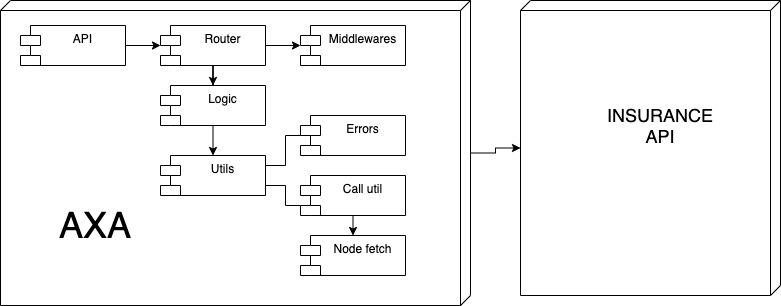

# AXA

## Introduction

Axa is a REST API working as a middleware of Insurance API 
## How to run it

### Important!

For running this API is required the `.env` file, which is not included for security reasons.
You can create your own `.env` at the root directory and store in it the following values: 
```
PORT: The port where the app will be listening
API_URL: The master API URL
MAIN_USERNAME: Credentials to authenticate with master API
MAIN_PASSWORD: Credentials to authenticate with master API
SECRET: A secret to sign JSON web tokens
TOKEN_EXP: JSON web tokens expiration time

```

### Install dependencies

```
$ npm i
```

### Run tests

```
$ npm test
```

### Run API
```
$ npm start
```

After running it, you will get a prompt message with a confirmation and the URL where the API is listenint.

Example:
```
axa 1.0.0 up and running on port 8000
```

## Technical description

This API was developed with Node.js and Express.js.

### Block diagram



## TODO

- Finish all unit tests
- Testing end to end
- Improve token vault 